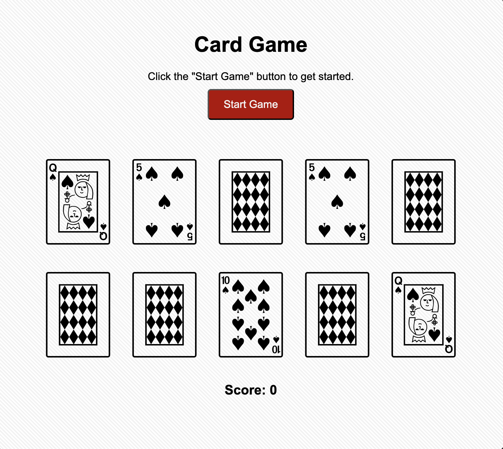
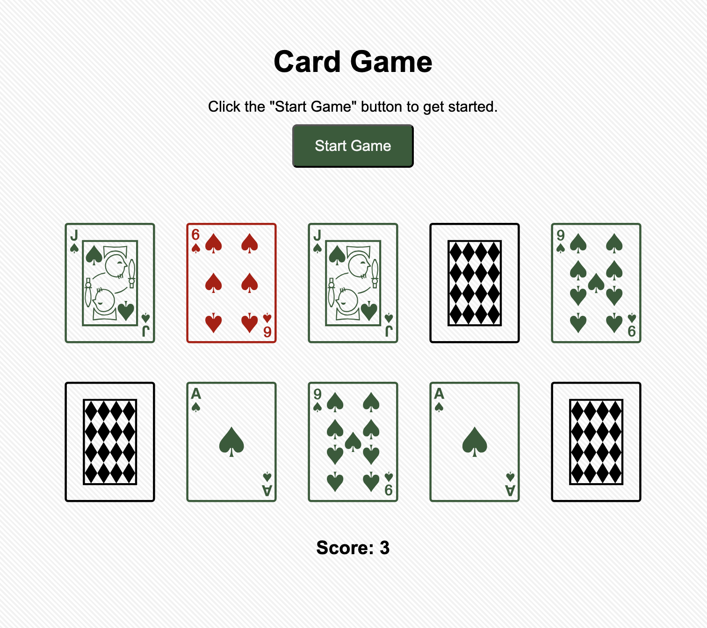

# ♠️  Matching Card Game

## Goal

Make a 10-card memory game where users select two cards at a time to check if they are a match.

- If the two cards **match**, they stay flipped over.
- If the two cards **do not match**, they flip back over.
- The game is complete when **all 5 pairs are matched**.

##  Images 

  
  

## How to Play

1. Click the **Start Game** button.
2. The game generates **10 shuffled cards** containing 5 matching pairs.
3. Click a card to reveal it.
4. Click a second card to check for a match.
5. Matching cards remain visible.
6. Non-matching cards flip back over.
7. Continue until all 10 cards have been matched.
8. Once all pairs are found, the game displays a winning message.

## Features

- Randomized cards each game
- 10 cards / 5 matching pairs
- Two-card matching logic
- Cards flip back when they do not match
- Matching cards remain flipped
- Score tracking
- Win detection
- Restart/start game functionality

## Built With

- HTML
- CSS
- JavaScript

## JavaScript Concepts Practiced
- Arrays
- Variables
- Functions
- Event listeners
- DOM manipulation
- `if/else` conditions
- Randomizing/shuffling data
- Updating elements with `textContent`
- Using `setTimeout()`
- Tracking game state

## Game Logic

When the game starts, five cards are randomly selected and duplicated to create five matching pairs.

The cards are then shuffled and displayed on the game board.

When a user selects a card, the game stores it as the first selection. After the user selects another card, the game compares the two cards.

If they match, they remain flipped over and the matched-card count increases. If they do not match, the cards are flipped back after a short delay.

The game continues until all five pairs have been found.

## What I Learned

Building this game helped me understand how JavaScript can be used to manage the state of a game and respond to user interactions.

One of the biggest challenges was making sure users could only select two cards at a time while the game checked whether they matched. I also practiced resetting variables when starting a new game and keeping track of matched cards and the player's score.

## Future Improvements

- Timer
- Best score
- Number of attempts
- Difficulty levels
- More cards
- Card flip animations
- Sound effects
- Leaderboard 
